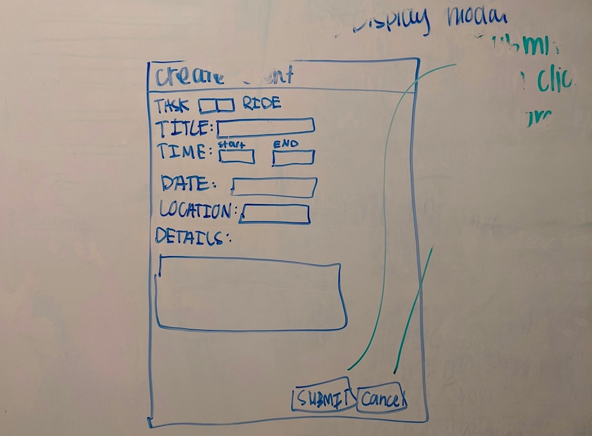

# Parent Trap

Don't worry, it's for your own good.

### About

Despite what the name might make you think, Parent Trap is here to help parents. We all have busy lives and keeping track of all the rides to soccer practice and permission slips signed that your kids need can be a lot to handle. With Parent Trap, your kids can post the things they need to the app, using their phones. You'll be able to track all of their needs and who has volunteered to do what, all in one place. Parent Trap is still in beta, but soon we'll be adding phone notifications and email reminders to further assist you on staying on top of everything.

**Design Whiteboard** 

- Collaborative team effort from project idea through project proposal and design
- Whiteboard sessions to set initial design ideas and MVP scope decisions
- Paper & Whiteboard wireframes and listing of technologies and API routes

**Login**

**Create Household - Submit**

**Create Household - Cancel**

**Event Card - Display Logic**

**Show More - Show Less**

**Event Logic**

**Nav Bar**

**Side Nav Bar**

**Create Event**

**Modal - Submit**

