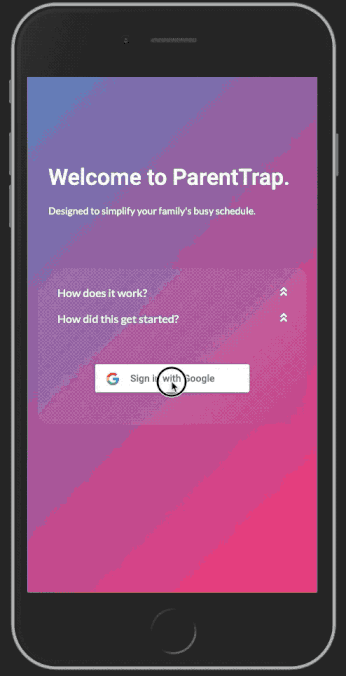
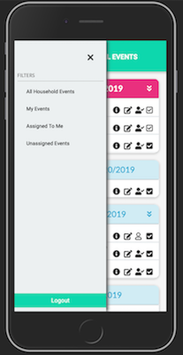

# Parent Trap
Don't worry, it's for your own good.

### About

Despite what the name might make you think, Parent Trap is here to help parents. We all have busy lives and keeping track of all the rides to soccer practice and permission slips signed that your kids need can be a lot to handle. With Parent Trap, your kids can post the things they need to the app, using their phones. You'll be able to track all of their needs and who has volunteered to do what, all in one place. Parent Trap is still in beta, but soon we'll be adding phone notifications and email reminders to further assist you on staying on top of everything.

#### Deployed Heroku Link :   <a href="https://evening-chamber-98293.herokuapp.com/">ParentTrap</a>

#### Github Repository:  <a href="https://github.com/LandGod/Parent-Trap">Repo - ParentTrap</a>

#### Demos

​		Start-up - Create a new Household   -------    Main Usage - Managing Events

​	     

#### Features 

* **Creating a household** - When you first sign in to the app, you will be prompted to create a household, listing yourself, and each of the members of your family or group. When those people sign in to the app using the google account associated with the email address you provided, they will automatically be directed to the household you set up. When you log in with an existing household, you will be taken to a dashboard where you can see all the events created by members of that household.
* **Creating events** - To create your first event, simply click the big plus icon in the center of dashboard. From here you can specify various things about your ride or task to be completed. These include start time, end time, location, and description. Once you're ready, hit create and it will be added to the central feed on everyone's dashboard. Any household member can create an event.
* **Claiming events** - Once you have some events created, members of the household may then choose to *claim* an event, to let everyone know that they have volunteered to handle it.
* **Event Completion** - Once a ride has been given, or task completed, the event can be marked as completed so that everyone knows it got done. 
* **Filtering** - If you would like to view only a subset of events in your household (such as *unassigned* or *assigned to me*) you can do so by clicking the hamburger menu in the upper left-hand corner, and selecting the appropriate filter from the pop-out menu.
* **Log In/Log Out** - Signing in to and out of the app works by using your existing google account. Authentication is handled by Google, using Firebase, which means you don't have another passwords to remember, and we never even know or store your password. This keeps you safe for data breaches.

### Usage

While Parent Trap is not available as an app from your phone's app store, it was created to run on mobile devices primarily, so heading to the website on your phone should work just great. You can also navigate to the website on your computer for al the same features on a larger screen.

### Technology

The Parent Trap front-end runs on React.js, using Bootstrap for styling, and React Router for user navigation. On the back-end, our server runs on Express, via Node.js. Our authentication is handled via the Firebase Oauth API and our data storage uses Mongoose to interact with a MongoDB NoSQL database. 

#### Design Details

- [**Project Proposal**](Proposal.md)
- [**Design Whiteboards**](DetailDesign.md)

### Screen Captures

#### Roadmap

The current version of Parent Trap is very a minimum viable product and, while we're very pleased with the current functionality, we also have big plans for expanding the list of features to help busy parents and their kids even more! 

Current planned features include:

* Automatically send email invites to people you add to your household
* Add push notifications for upcoming assigned events and new unassigned events 
* Allow household members to assign events to other members
* Support for users belonging to more than one household
* Allow users to update their household information
* Implement different levels of permissions for different household members 

### Authors and acknowledgment

This application was created and developed by Maci Slenes, Myles Carey, Jenn Henderson, and Daniel Gold. 

### Project status

The project is currently in active development. Check back soon for more!